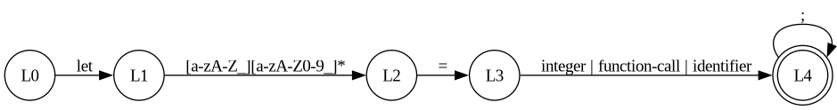
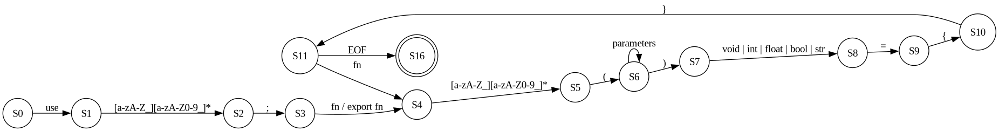
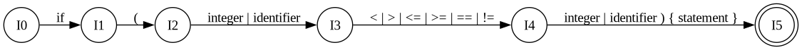
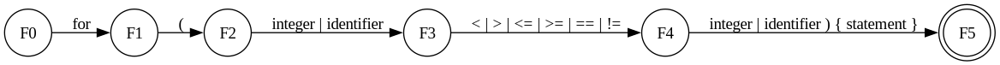
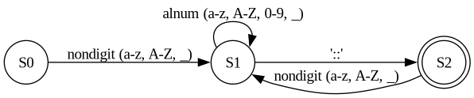

# Lexer

<div align="center">
  
  <h1> Universidad Nacional Autónoma de México </h1>
  <h2> Ingeniería en Computación </h2>
  <h2> Compiladores </h2>
  <h1> Lexer - Lexical Analysis </h1>
  <h2> Alumnos: </h2>
  <h3>320198388</h3>
  <h3>320051665</h3>
  <h3>320298608</h3>
  <h3>320244612</h3>
  <h3>320054336</h3>
  <h2> Grupo 5 </h2>
  <h2> Semestre 2025-2 </h2>
  <h4> México, CDMX. Marzo 2025 </h4>
</div>


## Table of contents   
1. [Introduction](#introduction)
2. [Theorical Background](#theoricalbackground)
3. [Development](#development)
   1. [Lexer construction](#lexerconstruction)
   2. [Context-Free Grammar](#context-freegrammar)  
4. [Results](#results)
5.  [Conclusion](#conclusion)
6.   [Sources](#sources)


## Introduction  
In this project, our team will develope a lexer using the Hare programming language, both for implementing the lexical analyzer and for the language it will process. The lexer is one of the first stages on a compiler or interpreter, its main function is to take a sequence of characters from the input and transform it into a string of tokens, that represent meaningful sintactic units of the language.
Using Hare as the development language will allow us to take advantage of its minimalist and efficient approach, ensuring a fast and reliable lexer. Throughout the development process, we will implement lexical rules that will define the structure of the target language, including identifiers, operators, keywords and other essential sintactic elements.
This project will not only allow us to explore the construction of lexical analyzers but also deepen our understanding of Hare ans its applicability in developing tools for programming languages.

## Theorical Background 
The first phase of a compiler is known as lexical analisys. In this phase, the source program is read character by character from left to right, organizing each part of the code into tokens.
Tokens are meaningful sequences of characters, than can be divided into six different categories depending on the characteristic of the token and the programming language, being the categories of the tokens the next ones:
* Keywords: the strings asigned to this group are the the ones that belong to strings that are reserved as special words for the language An example for this in Hare is the word let, to declare variables.
* Identifiers: these strings are asigned to this group when they are used to name a variable, function, etc.
* Punctuators: these strings are used to delimit a block of code or to indicate the end of a section. This could be "()", "{}" or "[]" to indicate where the block starts and ends, "," to separate strings or ";" to indicate the end of the line.
* Literals: these are strings that will never change, such as code inside of quotation marks.
* Operators: these characters are asigned to this group when their purpose is to indicate a type of operation that is going to be realized, such as "+", "-", etc.
Constants: these are strings that, once the code is executed their value will never change, such as numbers or strings asigned to variables.

To create our lexical analyzer we decided to use a language called Hare. Hare is a language designed to be simple, stable, and robust, using a static type system, manual memory managment and minimal runtime. This language was specially designed to be used on operating systems, compilers and other low level, high performance tasks

## Development

### Lexer construction
To create the lexer, first we needed to know what keywords formed part of the hare language so as to make clear to the lexer, if those words appeared, that they are not identifiers. For this, we created a document called tokens.ha where you can see the list of keywords found in the hare language.

### Context-Free Grammar
The following context-free grammar was developed by the team as an initial step for the syntax analyzer, applying left factoring and right recursion to reduce ambiguity and avoid infinite loops. It is represented in Backus-Naur Form and is based on a reading example used as a test.
```
<program> ::= <import> <function-declaration> <function-declaration>

<import> ::= "use" <identifier> ";"

<function-declaration> ::= <function-prefix> <identifier> "(" <parameters> ")" <return-type> "=" <block>

<function-prefix> ::= "export" "fn" | "fn"

<return-type> ::= "void" | <primitive-type>

<parameters> ::= <parameter> <parameters'>
<parameters'> ::= "," <parameter> <parameters'> | ε

<parameter> ::= <identifier> ":" <primitive-type>

<block> ::= "{" <statements> "}"

<statements> ::= <statement> <statements> | ε

<statement> ::= <variable-declaration> ";"
              | <loop>
              | <function-call> ";"
              | <assignment> ";"
              | <return-statement> ";"
              | <conditional>

<variable-declaration> ::= "let" <identifier> "=" <expression>

<loop> ::= "for" "(" <condition> ")" <block>

<condition> ::= <expression>

<assignment> ::= <identifier> <assignment-operator> <expression>

<assignment-operator> ::= "=" | "-="

<expression> ::= <term> <expression'>

<expression'> ::= <binary-operator> <term> <expression'> | ε

<term> ::= <function-call> | <integer> | <identifier>

<binary-operator> ::= "+" | "-" | "*" | "/"

<function-call> ::= <identifier> <function-call'>

<function-call'> ::= "::" <identifier> "(" <arguments> ")" "!" 
                   | "(" <arguments> ")"

<arguments> ::= <expression> <arguments'>
<arguments'> ::= "," <expression> <arguments'> | ε

<return-statement> ::= "return" <expression>

<conditional> ::= "if" "(" <condition> ")" <block>

<primitive-type> ::= <integer> | <bool> | "void"

<bool> ::= "True" | "False" 

<integer> ::= [0-9]+

<identifier> ::= [a-zA-Z_][a-zA-Z0-9_]*
```
The reading example is the following Hare code (fac.ha), located in the testfiles directory. The CFG is specific for the code:

```hare
use fmt;

export fn main() void = {
	let n = 5;
	for (n >= 0) {
		fmt::printfln("n: {} \tfac(n): {}", n, fac(n))!;
		n -= 1;
	};
};

fn fac(n: int) int = {
	if (n <= 1) {
		return 1;
	};
	return n * fac(n-1);
};

```
Here are some examples of DFA from the previous grammar:











## Results

## Conclusion

## Sources
https://www.geeksforgeeks.org/introduction-of-lexical-analysis/
https://harelang.org/
