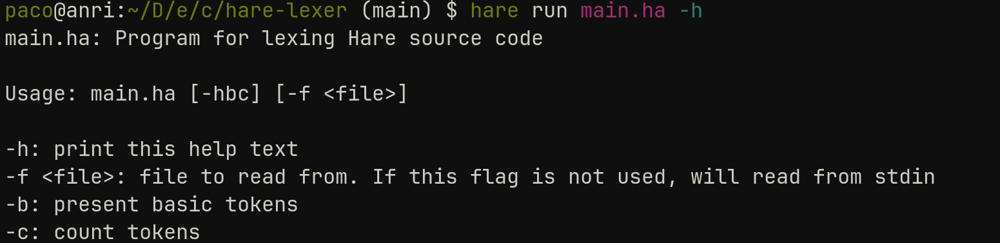
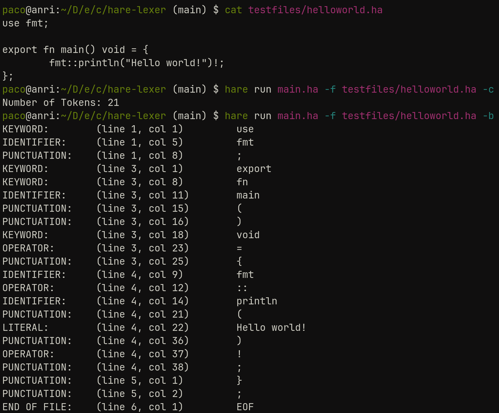

# Lexer

<div align="center">
  
  <p> Universidad Nacional Autónoma de México </p>
  <p> Ingeniería en Computación </p>
  <p> Compiladores </p>
  <p> Lexer - Lexical Analysis </p>
  <p> Alumnos: </p>
  <p>320198388</p>
  <p>320051665</p>
  <p>320298608</p>
  <p>320244612</p>
  <p>320054336</p>
  <p> Grupo 5 </p>
  <p> Semestre 2025-2 </p>
  <p> México, CDMX. Marzo 2025 </p>
</div>

## Introduction
In this project, our team will develope a lexer using the Hare programming language, both for implementing the lexical analyzer and for the language it will process. The lexer is one of the first stages on a compiler or interpreter, its main function is to take a sequence of characters from the input and transform it into a string of tokens, that represent meaningful sintactic units of the language.
Using Hare as the development language will allow us to take advantage of its minimalist and efficient approach, ensuring a fast and reliable lexer. Throughout the development process, we will implement lexical rules that will define the structure of the target language, including identifiers, operators, keywords and other essential sintactic elements.
This project will not only allow us to explore the construction of lexical analyzers but also deepen our understanding of Hare ans its applicability in developing tools for programming languages.

## Theorical Background
The first phase of a compiler is known as lexical analisys. In this phase, the source program is read character by character from left to right, organizing each part of the code into tokens.
Tokens are meaningful sequences of characters, than can be divided into six different categories depending on the characteristic of the token and the programming language, being the categories of the tokens the next ones:
* Keywords: the strings asigned to this group are the the ones that belong to strings that are reserved as special words for the language An example for this in Hare is the word let, to declare variables.
* Identifiers: these strings are asigned to this group when they are used to name a variable, function, etc.
* Punctuators: these strings are used to delimit a block of code or to indicate the end of a section. This could be "()", "{}" or "[]" to indicate where the block starts and ends, "," to separate strings or ";" to indicate the end of the line.
* Literals: these are strings that will never change, such as code inside of quotation marks.
* Operators: these characters are asigned to this group when their purpose is to indicate a type of operation that is going to be realized, such as "+", "-", etc.
Constants: these are strings that, once the code is executed their value will never change, such as numbers or strings asigned to variables.

Tokens are the inputs for syntax analysis and interpret the meaning of these tokens. Syntax analysis checks if the tokens are arranged according to the language’s grammar. A context-free grammar define the syntax rules of a programming language. A grammar is said to be the context-free grammar (CFG) if every production is in the form of:

G -> (V&cup;T)*, where G &isin; V

This equation states that every production which contains any combination of the 'V' variable or 'T' terminal is said to be a context-free grammar.

A context-free grammar is defined by:
1. Nonterminal symbols (variables).
2. Terminal symbols (alphabet).
3. Production rules.
4. Start symbol.

Context-free grammars have some problems and limitations, including ambiguity and left recursion. Ambiguity generates multiple parse trees for the same input, and left recursion can cause an infinite loop. To create an optimal syntax analyzer, we need to ensure that the CFG is deterministic, right-recursive (eliminating left recursion), and reduces or eliminates ambiguity.

A grammar has direct left recursion if there is a derivation: S -> S𝛼|β, where 𝛼 is a string that can contain terminals or non-terminals, and β is a terminal . The algorithm to convert it to right recursion begins by introducing a new nonterminal and writing it at the end of every production: S -> β S'

The newly produced nonterminal S' can either produce S' or it can produce a new production where the terminals or non-terminals that follow S will be replaced by the new nonterminal S' at the end of the term: S' -> 𝛼S'|ε

After conversion, the new equivalent production is:

S -> β S'

S' -> 𝛼S'|ε

This process can be repeated for all the introduced nonterminal if they still have left recursion. Additionally, it can be combined with left factoring.

Left factoring removes the common left factor that appears in two or more productions of the same nonterminal, introducing a new nonterminal. For the production:

A -> 𝛼β1|𝛼β2|𝛼β3

After applying left factoring, the grammar becomes:

A -> 𝛼A'

A' -> β1|β2|β3

In compiler design, BNF stands for Backus-Naur Form notation. It is a formal method for describing the syntax of programming languages, which is understood as the Backus-Naur Form introduced by John Backus and Peter Naur in 1960. The symbol '::=' means "may expand into" or "may be replaced with." Every name is surrounded by angle brackets (< >), whether it appears on the left- or right-hand side of the rule. Simply juxtaposing expressions indicates sequencing, and a vertical bar (|) indicates choice.

To create our lexical analyzer we decided to use a language called Hare. Hare is a language designed to be simple, stable, and robust, using a static type system, manual memory managment and minimal runtime. This language was specially designed to be used on operating systems, compilers and other low level, high performance tasks

## Development

### Lexer construction

One of the ways of creating a lexer for a programming language is to, using a CFG as a base, construct a DFA and code it out in some programming language. If *regex* are used to represent a template for each of the tokens, doing this would require writing a *regex* parser and generate code based on it, which is almost making a FLEX clone. Creating the DFA manually and writning code based on it is more tedious, but easier and quicker to do. While the code written is not a DFA explicitely, it consumes characters in the same order and following the same conditions as a DFA would.

The Hare standard library already has a parser that works with Hare code. This means that we have a baseline we can follow and run our test against. In order to not write testing code twice, it was decided to write this lexer using the same interface as the lexer in the *stdlib*.

The file tree for this project looks like this:

```
.
├── INSTALLING_HARE.md
├── lex
│   ├── lex.ha
│   └── token.ha
├── LICENSE
├── main.ha
├── README.md
└── testfiles
    ├── fac.ha
    ├── greeting.ha
    ├── helloworld.ha
    ├── readfile.ha
    └── slice.ha
```

The `main.ha` file contains the driver code for testing our lexer. The actual lexer is in the `lex` directory.

A comprehensive list of keywords and operators is defined in the `token.ha` file along with some type definitions for representing the tokens themselves and a location in the text file. This file was taken from the original Hare code, because it saves time when looking for each keyword. The file, however, holds little to no logic.

The lexer logic is in `lex.ha`. The lexer type definition is here and all the functions that manipulate it are here as well. Broadly, the `lex` function takes a lexer (whis is only a struct to hold the state of the lexer) and returns the next token. `lex` has to be called multiple times in order to get all tokens in a file.

Whenever `lex` is called, the next rune (almost a synonym of character, but when talking of *UTF8* encoding) is read, updating the lexer state, and depending on the pattern it follows, a token is matched. When dealing with tokens that span more than one rune, more characters are consumed automatically and matched with the valid patterns.

For example, when reading the `=` rune, the character after that is also read and compared with the following patterns: `==`, `=>`. If the second rune was a `=` or a `>`, we know the comparison operator or the arrow operator were read. If it is another thing, then we know it was the assignment operator and the lexer goes one rune back. The lexing process will continue with another `lex` call.

If a digit is read, then more runes are consumed until they are not digits. This way integer constants can be recognized. Floating point constants are not included, because numbers are actually somewhat cumbersome to parse. Consider these:

```c
100 // Valid
100.5 // valid
001 // invalid
560.8.1 //invalid
1_000_000 // valid
1_000_000_ // invalid
10e4 /valid
0b100101010110 // valid
0o561764 // valid
0xFFee00 // validmm
0xGG0000 // invalid
```

We would need to encode these (and more) cases in order to make a full number lexer. This is why only positive integers in base 10, 2, 8 and 16 were included.

String literals are read whenever a `"` is found. Identifiers are read whenever a character which is not part of an operator, a `"` or a digit is read, so the following characters are included they do not match the grammar rule for an identifier. If the identifier matches a keyword, then it is a keyword instead.

This way, all keywords can be detected, as well as all operators, identifiers and most string literals. This means that we can lex most basic hare programs, as we will see shortly.


### Context-Free Grammar
The following context-free grammar was developed by the team as an initial step for the syntax analyzer, applying left factoring and right recursion to reduce ambiguity and avoid infinite loops. It is represented in Backus-Naur Form and is based on a reading example used as a test.
```
<program> ::= <import> <function-declaration> <function-declaration>
<import> ::= "use" <identifier> ";"

<function-declaration> ::= <function-prefix> <identifier> "(" <parameters> ")" <return-type> "=" <block>

<function-prefix> ::= "export" "fn" | "fn"

<return-type> ::= "void" | <primitive-type>

<parameters> ::= <parameter> <parameters'>
<parameters'> ::= "," <parameter> <parameters'> | ε

<parameter> ::= <identifier> ":" <primitive-type>

<block> ::= "{" <statements> "}"

<statements> ::= <statement> <statements> | ε

<statement> ::= <variable-declaration> ";"
              | <loop>
              | <function-call> ";"
              | <assignment> ";"
              | <return-statement> ";"
              | <conditional>

<variable-declaration> ::= "let" <identifier> "=" <expression>

<loop> ::= "for" "(" <condition> ")" <block>

<condition> ::= <expression>

<assignment> ::= <identifier> <assignment-operator> <expression>

<assignment-operator> ::= "=" | "-="

<expression> ::= <term> <expression'>

<expression'> ::= <binary-operator> <term> <expression'> | ε

<term> ::= <function-call> | <integer> | <identifier>

<binary-operator> ::= "+" | "-" | "*" | "/"

<function-call> ::= <identifier> <function-call'>

<function-call'> ::= "::" <identifier> "(" <arguments> ")" "!" 
                   | "(" <arguments> ")"

<arguments> ::= <expression> <arguments'>
<arguments'> ::= "," <expression> <arguments'> | ε

<return-statement> ::= "return" <expression>

<conditional> ::= "if" "(" <condition> ")" <block>

<primitive-type> ::= <integer> | <bool> | "void"

<bool> ::= "True" | "False" 

<integer> ::= [0-9]+

<identifier> ::= [a-zA-Z_][a-zA-Z0-9_]*
```
The reading example is the following Hare code (fac.ha), located in the testfiles directory. The CFG is specific for the code:

```hare
use fmt;

export fn main() void = {
	let n = 5;
	for (n >= 0) {
		fmt::printfln("n: {} \tfac(n): {}", n, fac(n))!;
		n -= 1;
	};
};

fn fac(n: int) int = {
	if (n <= 1) {
		return 1;
	};
	return n * fac(n-1);
};

```
Here are some examples of DFA from the previous grammar:


### Test inputs

The reading test presented previously can be used to test the ability of our lexer to correctly tokenize a file.

A CLI was made for our lexer in order to test it with any source code file. It can print all tokens it finds, along with its position in the file and type of token. It can count the tokens as well. In these tests, the count is shown because otherwise the output would be a little too long.

This is the output the built-in (i.e. not made by us) lexer shows:

```
$ hare run main.ha -f testfiles/fac.ha -c
Number of Tokens: 80
```

The output presented by our own lexer is the same:

```
$ hare run main.ha -f testfiles/fac.ha -c
Number of Tokens: 80
```

Another file that can be tested is this one, which reads a file and prints its contents:

```hare
use errors;
use fmt;
use io;
use os;
use fs;

export fn main() void = {
	let path = os::args[1];

	const file = match(os::open(path)) {
	case let f: io::file =>
		yield f;
	case let err: fs::error =>
		fmt::fatalf("Unable to open {}: {}",
			path, fs::strerror(err));
	};
	defer io::close(file)!;

	let buffer: *[65535]u8 = alloc([0...]);
	defer free(buffer);

	for (true) {
		const n = match(io::read(file, buffer)) {
		case let err: errors::error =>
			fmt::fatalf("Error reading {}: {}",
				path, errors::strerror(err));
		case let m: (size | io::EOF) =>
			yield m as size;
		};
		io::write(os::stdout, buffer[..n])!;
		if (n < 65535) {
			break;
		};
	};
};
```

This program is interesting because it includes many of Hare's keywords and other tokens like constants. The output from the reference lexer is:

```
$ hare run main.ha -f testfiles/readfile.ha -c
Number of Tokens: 209
```

Our lexer produces the same output!:

```
$ hare run main.ha -f testfiles/readfile.ha -c
Number of Tokens: 209
```

Screenshots will be shown in the *results* section to provide more tangible proofs.

## Results

Here we present some screenshots of our lexer in action:






## Conclusion
With the obtained results, the lexer can be used to proceed to the next stage, building upon the ideas developed in the creation of the context-free grammar for the selected example. At this point, the syntactic analysis phase begins, where the structured tokens are processed according to the grammar rules to construct a parse tree or an abstract syntax tree (AST). This step is crucial because it ensures that the source code follows the correct syntax and allows further stages, such as semantic analysis and code generation, to operate efficiently.

Additionally, optimizations in lexical analysis, such as minimizing the number of states in the DFA or refining token classification strategies, can enhance the performance of the compiler. The integration between lexical and syntactic analysis must be seamless to avoid ambiguities and inefficiencies in parsing. As a result, techniques like left factoring and right recursion not only improve the structure of the grammar but also contribute to making the parsing process more predictable and efficient.

Ultimately, a well-designed lexer and a properly structured context-free grammar form the foundation for a robust compiler. They ensure that source code is analyzed correctly from the beginning, reducing errors and improving the overall compilation process. This structured approach is essential for developing reliable programming language tools and efficient language processing systems.

## Sources
[1]Drew DeVault, "The Hare programming language",harelang, 14-july-2024. [https://harelang.org/].[Accedido: Marzo-2025]
[2]"Introduction of Lexical Analysis", geeksforgeeks, 27/January/2025. [https://www.geeksforgeeks.org/introduction-of-lexical-analysis/]. [Accedido: Marzo-2025]
